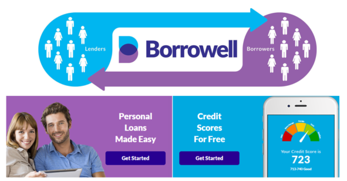

# Fintech Case Study

## Overview and Origin

* **Borowell Inc.**

* The company was incorporated in 2014

* The founders of the company are Andrew Graham and Eva Wong

* *Borrowell is a Canadian company with a single goal in mind: to make financial prosperity possible for everyone. By providing access to credit education, innovative digital tools and personalized experiences, we strive to help all Canadians feel in control and optimistic about their future.*
* Borrowell has raised a total of $92M in funding over 6 rounds. The company is funded by 25 investor. Business Development Bank of Canada and Kensington Capital Partners Limited are the most recent investors

## Business Activities:

* Borrowell offers secured cards and credit building loans to provide underserved consumers with affordable access to credit and a means to build credit history and achieve long-term financial success.

* Over 2 million Canadians have joined Borrowell. Borrowell.com's audience is 59.41% male and 40.59% female. The largest age group of visitors are 25 - 34 year olds.

* Offer Free credit scores and reports from Equifax

* Borrowell uses 15 technology products and services including HTML5, jQuery, PhP, Google Analytics, and so on

## Landscape:

* Lending

* AI and smart and data-driven technologies, robotic process automations

* Mogo, FundThrough, Thinking Capital

## Results

* Borrowell's marketplace features over 75 financial product providers, including American Express, BMO, Capital One, RBC and CIBC

* Borrowell has been recognized in numerous awards, including Globe and Mail's Top Growing Companies, LinkedIn's Top Startups in Canada, CB Insights’ Top 250 Fintechs, and Deloitte's Technology Fast 500. In 2021 to-date alone, Borrowell has provided over 38 million credit report updates to its members

* Borrowell ranked 22nd in the sam category as competitiveness

## Recommendations

* NetSuite's clould-based enterprise resource plan system

* It effectively automates crucial business workflows across numerous sectors. Additionally, it offers powerful capabilities for full accounting, order tracking, and purchase processing, as well as cutting-edge modules for managing warehouses, shipping, fulfilment, and compliance. 

* NetSuite ERP is an enterprise resource planning system hosted in the cloud that helps businesses run more efficiently by the automation of essential activities and the provision of real-time insights into financial and operational standing.

* Because NetSuite ERP improve opreation, efficient and productivity, gain inventory visibility, and control the flow of good across the value chain, from supplier to customer. 

https://fintechnews.ch/fintech/fintech-canada-report/19783/
https://www.accenture.com/ca-en/services/banking/lending
https://stackshare.io/borrowell/borrowell
https://www.crunchbase.com/organization/borrowell
https://borrowell.com/
https://www.globenewswire.com/en/news-release/2021/11/18/2337115/0/en/Borrowell-Now-Serves-Over-2-Million-Canadians-as-Financial-Wellness-Remains-Top-of-Mind-for-Canadians-During-the-Pandemic.html
https://www.similarweb.com/website/borrowell.com/#ranking
https://www.netsuite.com/portal/products/erp.shtml